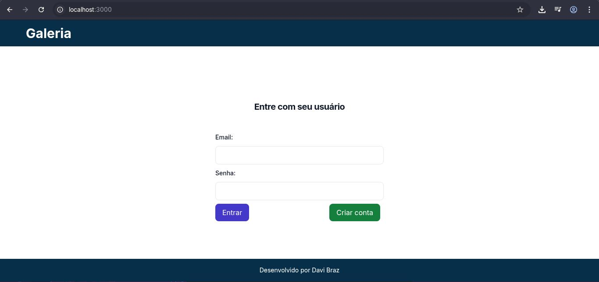
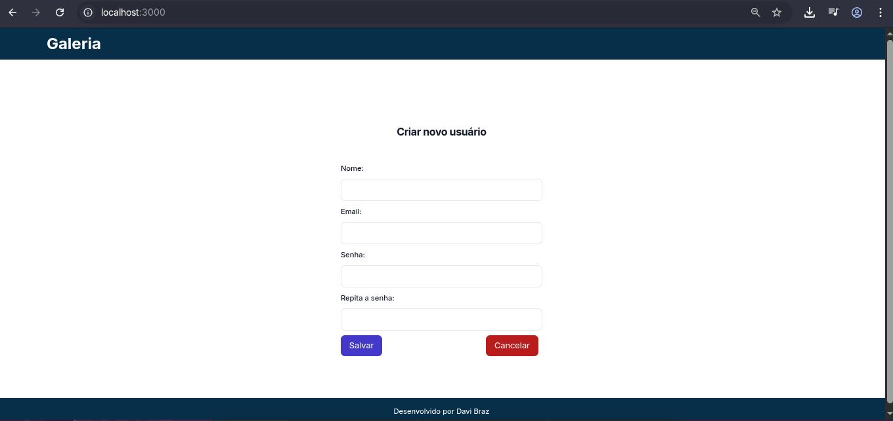
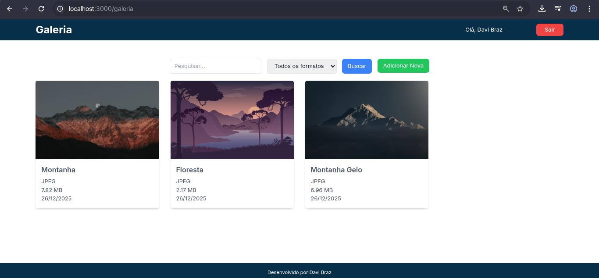
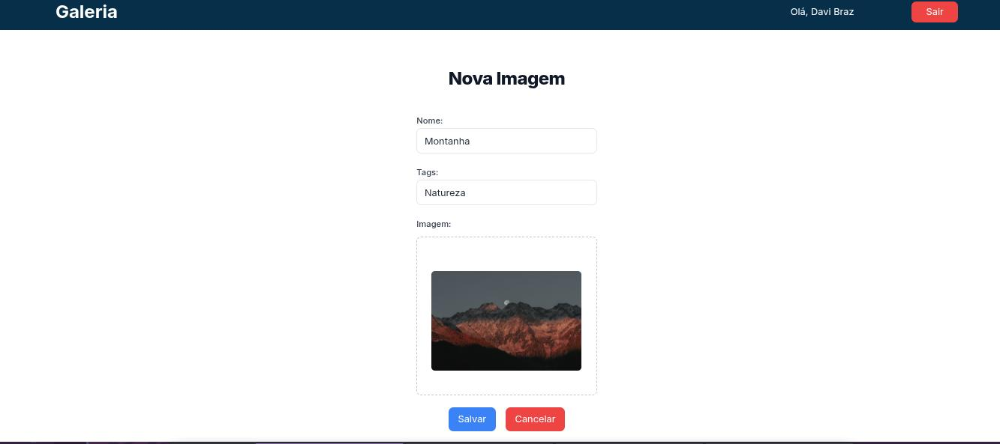

# 📸 Galeria de Imagens – Full Stack

## Sobre o projeto

Este projeto consiste em uma **aplicação full stack para gerenciamento de postagens de imagens**, com autenticação de usuários, upload, listagem, busca e remoção de imagens.

O **backend** foi desenvolvido com **Spring Boot**, seguindo boas práticas de arquitetura em camadas, utilizando **Spring Security** para autenticação baseada em token, **JPA/Hibernate** para persistência e **PostgreSQL** como banco de dados relacional.

O **frontend** foi desenvolvido com **Next.js** e **TypeScript**, utilizando **Tailwind CSS** para estilização, compondo uma interface moderna e responsiva para login, upload e visualização das imagens.

Toda a aplicação é orquestrada com **Docker e Docker Compose**, facilitando a execução e padronizando o ambiente de desenvolvimento.

## Endpoints disponíveis

### 👤 Usuários

- **Criar usuário**  
  `POST /v1/users`  
  Cria um novo usuário no sistema a partir dos dados informados no corpo da requisição.

- **Autenticar usuário**  
  `POST /v1/users/auth`  
  Realiza a autenticação do usuário utilizando e-mail e senha.  
  Retorna um token de autenticação que deve ser utilizado para acessar as rotas protegidas.

---

### 🖼 Imagens

- **Upload de imagem**  
  `POST /v1/images`  
  Realiza o upload de uma imagem para o sistema.  
  **Parâmetros (multipart/form-data):**
    - `file`: arquivo da imagem
    - `name`: nome da imagem
    - `tags`: lista de tags associadas à imagem

- **Buscar imagem por ID**  
  `GET /v1/images/{id}`  
  Retorna o conteúdo binário da imagem correspondente ao ID informado, com o `Content-Type` definido de acordo com a extensão do arquivo.

- **Listar / Buscar imagens**  
  `GET /v1/images`  
  Retorna uma lista de imagens cadastradas.  
  **Query params opcionais:**
    - `extension`: filtra imagens pela extensão (ex: png, jpg)
    - `query`: termo de busca para nome ou tags

- **Excluir imagem**  
  `DELETE /v1/images/{id}`  
  Remove a imagem correspondente ao ID informado.

## Funcionalidades

- Cadastro de usuários
- Autenticação de usuários com Spring Security
- Geração de token para acesso às rotas protegidas
- Upload de imagens via formulário (multipart/form-data)
- Associação de nome e tags às imagens
- Armazenamento de imagens e metadados no backend
- Listagem de imagens cadastradas
- Busca de imagens por nome, tags ou extensão
- Visualização de imagens diretamente pela API
- Exclusão de imagens por ID
- Proteção de endpoints sensíveis por autenticação
- Interface web responsiva para login, upload e galeria de imagens
- Integração completa entre frontend (Next.js) e backend (Spring Boot)
- Execução do projeto em ambiente containerizado com Docker e Docker Compose

## 📸 Galeria de Imagens

Confira algumas telas do frontend:

|                  Login                           |                 Cadastro de Usuário                    |                     Galeria de Imagens                      |                  Upload de Imagem                  |
|:------------------------------------------------:|:----------------------------------------------------:|:----------------------------------------------------------:|:-------------------------------------------------:|
|                        |  |                  |    |

---

## Tecnologias utilizadas

### Backend
- Java 17+
- Spring Boot
- Spring Framework
- Spring Security
- Spring Web (REST API)
- Spring Data JPA
- Hibernate
- PostgreSQL
- Maven
- Lombok

### Frontend
- Next.js
- React
- TypeScript
- Tailwind CSS
- PostCSS

### Infraestrutura e DevOps
- Docker
- Docker Compose

## Como executar o projeto

### Pré-requisitos
- Docker
- Docker Compose
- Git

---

### Passo a passo

```bash
# Clonar o repositório
git clone https://github.com/DaviBrazz/galeria-imagens-react-springboot.git

# Entrar na pasta do projeto
cd galeria-imagens-react-springboot

# Subir os containers com Docker Compose
docker-compose up --build

```
## Autor: `Davi Braz`